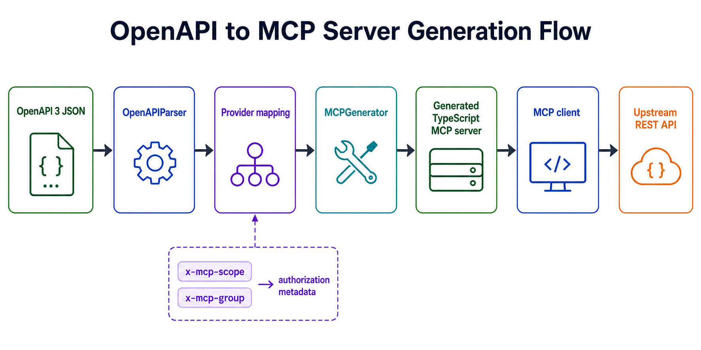
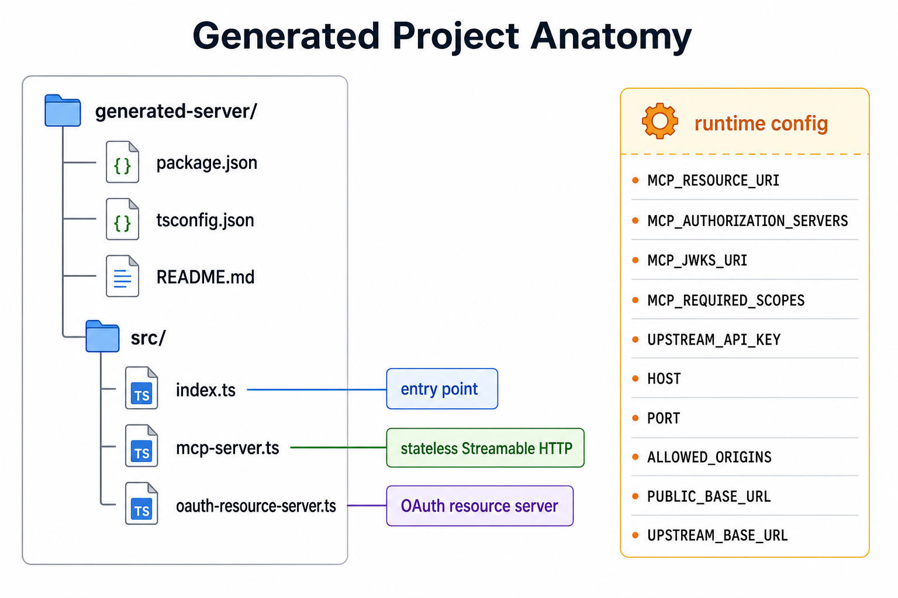
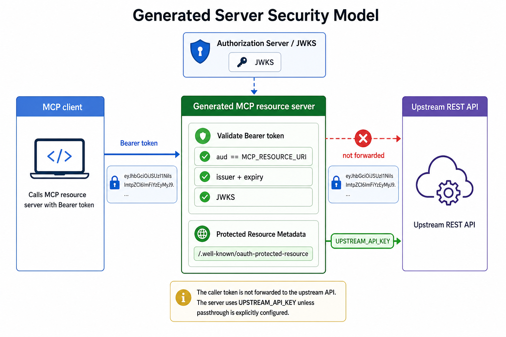

# OpenAPI MCP Generator


Generate secure [Model Context Protocol (MCP)](https://modelcontextprotocol.io) servers from OpenAPI 3 JSON specifications.

The generated servers are TypeScript projects built on the official `@modelcontextprotocol/sdk`. They expose OpenAPI operations as MCP tools over stateless Streamable HTTP and run as OAuth 2.1 resource servers.



## What This Generates

Each generated server contains:

- `src/index.ts` - entry point that starts the server.
- `src/mcp-server.ts` - SDK-based MCP server, Streamable HTTP transport, tool registration, upstream API routing, and request guards.
- `src/oauth-resource-server.ts` - Protected Resource Metadata and JWT verification helpers.
- `package.json`, `tsconfig.json`, and generated `README.md`.



The emitted server:

- uses `McpServer` and `StreamableHTTPServerTransport` from `@modelcontextprotocol/sdk`;
- creates a fresh server and transport per request with `sessionIdGenerator: undefined`;
- serves MCP at `POST /mcp`;
- rejects `GET /mcp` and `DELETE /mcp` with method-not-allowed responses;
- publishes Protected Resource Metadata at `/.well-known/oauth-protected-resource`;
- validates bearer tokens with `jose` against a JWKS URL;
- enforces token `aud` against the configured MCP resource URI;
- never forwards the caller token upstream by default;
- validates tool arguments with `zod`;
- binds to `127.0.0.1` by default and checks `Host` and `Origin`.

## Quick Start

Install and build the generator:

```bash
npm install
npm run build
```

List registered providers:

```bash
npm run list-providers
```

Generate a server from an OpenAPI JSON file:

```bash
npm run generate -- \
  --spec ./specs/test/simple-spec.json \
  --output ./output/example-mcp \
  --provider generic \
  --name example-mcp \
  --resource-uri urn:mcp:example \
  --auth-server https://auth.example.com
```

Build and run the generated server:

```bash
cd ./output/example-mcp
npm install
npm run build

MCP_RESOURCE_URI=urn:mcp:example \
MCP_AUTHORIZATION_SERVERS=https://auth.example.com \
MCP_JWKS_URI=https://auth.example.com/.well-known/jwks.json \
UPSTREAM_API_KEY=your_upstream_api_key \
npm start
```

The generated server listens at `http://127.0.0.1:3000/mcp` unless `HOST` or `PORT` is set.

## CLI Reference

Primary command:

```bash
npm run generate -- --spec <openapi.json> --output <dir> [options]
```

Common options:

| Option | Default | Description |
|---|---:|---|
| `--spec <path>` | required | OpenAPI 3 JSON file. YAML parsing is not implemented. |
| `--output <dir>` | required | Directory for the generated server project. |
| `--provider <name>` | `generic` | Supported provider: `generic`. Experimental providers: `stripe`, `paypal`. |
| `--name <name>` | derived from spec title | Generated server/package name. |
| `--version <version>` | `1.0.0` | Generated server version. |
| `--description <text>` | derived from spec title | Generated server description. |
| `--config <path>` | none | JSON config file merged with CLI options. |
| `--resource-uri <uri>` | `urn:mcp:<server-name>` | Canonical MCP resource URI and required JWT audience. |
| `--auth-server <url...>` | none | Authorization server issuer URL(s) advertised in metadata. |
| `--jwks-uri <url>` | derived from first auth server when possible | JWKS endpoint used for token verification. |
| `--issuer <url>` | first auth server | Expected JWT `iss`. |
| `--required-scope <scope...>` | none | Baseline scopes enforced by SDK bearer middleware. |
| `--upstream-auth <mode>` | `env-credential` | `none`, `env-credential`, or `passthrough`. |
| `--upstream-base-url <url>` | first OpenAPI `servers[0].url` | Runtime upstream API base URL. |
| `--allow-token-passthrough` | false | Shortcut for `--upstream-auth passthrough`; discouraged. |
| `--authz-hook` | false | Emit a call to local `./authz-hook.ts` before each tool call. |
| `--groups-claim <name>` | `groups` | JWT claim used by `x-mcp-group` tool visibility. |

Provider listing:

```bash
npm run list-providers
```

Experimental Stripe shortcut:

```bash
npm run dev -- stripe-test --output ./output/stripe-mcp
```

## Runtime Configuration

Generated servers are configured through environment variables:

| Variable | Purpose |
|---|---|
| `HOST` | Bind host. Defaults to `127.0.0.1`. |
| `PORT` | Bind port. Defaults to the generation config, usually `3000`. |
| `PUBLIC_BASE_URL` | Public server base URL used in resource metadata challenges. |
| `MCP_RESOURCE_URI` | Required token audience. Overrides generation-time `--resource-uri`. |
| `MCP_AUTHORIZATION_SERVERS` | Comma-separated authorization server issuer URLs. |
| `MCP_JWKS_URI` | JWKS URL used by `jose` token verification. |
| `MCP_ISSUER` | Expected token issuer. |
| `MCP_REQUIRED_SCOPES` | Comma-separated baseline scopes required for all MCP requests. |
| `ALLOWED_ORIGINS` | Comma-separated browser origins allowed through the Origin guard. |
| `UPSTREAM_BASE_URL` | Upstream REST API base URL. Overrides the OpenAPI server URL. |
| `UPSTREAM_API_KEY` | Separate upstream credential used when `upstream-auth` is `env-credential`. |

## Security Model

Generated servers are OAuth 2.1 resource servers. They validate the caller's bearer token before handling MCP requests and require the JWT audience to identify this MCP server.



Important boundaries:

- The MCP access token authenticates the caller to the MCP server.
- The upstream API credential authenticates the MCP server to the upstream REST API.
- These credentials are separate by default.
- `passthrough` mode forwards the caller token upstream and should be used only when the upstream API is intentionally the same protected resource.
- `x-mcp-scope` on an OpenAPI operation becomes a per-tool execution scope. Missing scope returns `403 insufficient_scope`.
- `x-mcp-group` on an OpenAPI operation controls tool visibility in `tools/list` based on the configured groups claim.

See [Transport Security](./docs/TRANSPORT-SECURITY.md) for the concrete request guards emitted into generated servers.

## Provider Model

Providers do two jobs:

1. Parse vendor-specific OpenAPI details when needed.
2. Map parsed operations to MCP tool names, descriptions, annotations, and metadata.

The actual server implementation is generated centrally from shared templates. Provider-specific server template trees are no longer used.

Provider status:

| Provider | Status | Use case | Notes |
|---|---|---|---|
| `generic` | Supported | Arbitrary OpenAPI specs | Uses base parsing and operation IDs as the naming source, subject to the OpenAPI limitations below. |
| `stripe` | Experimental | Stripe OpenAPI specs | Naming and annotations are implemented, but form and multipart request serialization is incomplete. Do not use for production integrations. |
| `paypal` | Experimental | PayPal OpenAPI specs | Naming is implemented, but referenced parameters and request bodies are not fully resolved. Do not use for production integrations. |

Experimental providers are retained for development and compatibility testing. They are not part of the supported provider surface and may generate incomplete upstream requests.

To add a provider:

1. Create `src/providers/<name>/provider.ts`.
2. Implement `IProvider` from `src/core/models/provider.ts`.
3. Register it in `src/providers/index.ts`.
4. Add focused tests for parsing and tool mapping.

Minimal provider:

```ts
import * as path from 'path';
import { BaseProvider } from '../../core/models/base-provider';

export class MyProvider extends BaseProvider {
  readonly name = 'my-provider';
  readonly version = '1.0.0';
  readonly description = 'My OpenAPI provider';

  protected get templatesDir(): string {
    return path.join(__dirname, 'templates');
  }
}
```

## OpenAPI Support

Currently supported by the generic provider:

- OpenAPI 3.x documents.
- JSON input files.
- Path, query, and JSON request-body properties.
- Operation-level `x-mcp-scope` and `x-mcp-group`.
- Operation IDs, summaries, descriptions, tags, responses, security, and components.

Current limitations:

- YAML parsing is intentionally not implemented.
- `$ref` parameter resolution is placeholder-level in the parser.
- Request-body routing currently flattens JSON object properties into tool arguments.
- Non-JSON request bodies are not deeply modeled.

## Testing

Run the test suite:

```bash
npm test
```

Run integration tests:

```bash
npm run test:integration
```

Run the generated-server runtime smoke test:

```bash
npm run test:e2e
```

Run the local red-team harness:

```bash
npm run test:red-team
```

Run linting:

```bash
npm run lint
```

See [Red Team Weekend](./docs/RED-TEAM-WEEKEND.md) for the manual weekend runbook, [Red Team Findings](./docs/red-team-findings.md) for the latest verified baseline, and [Red Team Weekend Report](./docs/red-team-weekend-report.html) for a standalone explanation of the process, results, and project value.

## Repository Layout

```text
src/
  cli/                 CLI entry point.
  core/
    generator/         Shared generated-server assembly.
    models/            Parser, provider, generator, and MCP types.
    parser/            OpenAPI 3 parser.
    registry/          Provider registry.
    templates/         Generated project templates.
    utils/             Template, string, and API helpers.
  providers/
    generic/           Base OpenAPI provider.
    stripe/            Stripe-specific parser/tool mapping.
    paypal/            PayPal-specific parser/tool mapping.
  test/                Unit, integration, and e2e tests.
docs/
  assets/              Documentation images generated with imagegen.
  examples/            Example generated-server usage.
specs/
  stripe/              Stripe OpenAPI fixture.
  paypal/              PayPal OpenAPI fixtures.
  test/                Small test specifications.
```

## License

MIT. See [LICENSE](./LICENSE).
